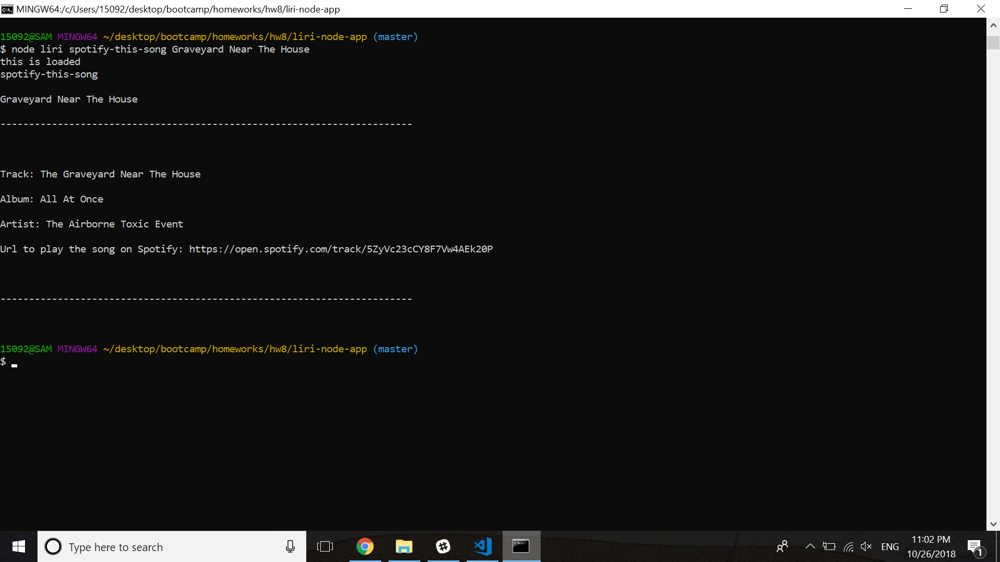
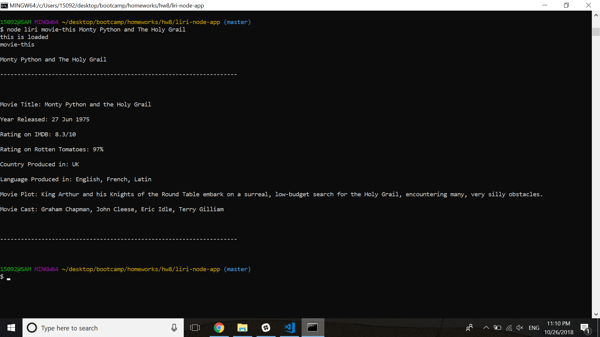
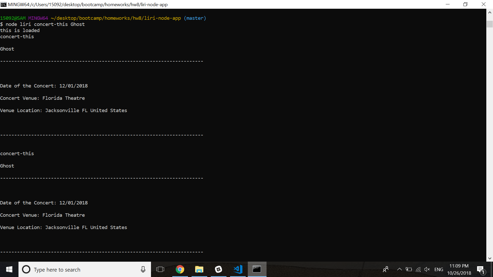
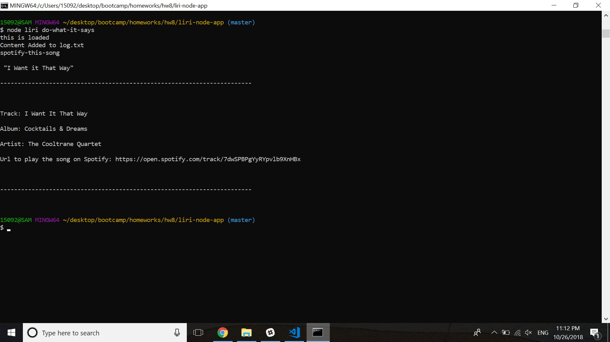

# liri-node-app

### Overview

During this project my goal is to create a Language Interpretation and Recognition Interface (LIRI). LIRI is a command line node app that takes in parameters and gives back data. The specific parameters that LIRI will take in will be a command for which specific module to use and a string that will determine what that module will search for using an ajax call through an API database.

##### Steps

1. Create the liri file that will run each module
    1. Create a module to run the spotify search
        1. 
    1. Create a module to run the omdb search
        1. 
    1. Create a module to run the bands in town search
        1. 
    1. Create a way to read a random text file and output the results of whatever search is within the text file
        1. 